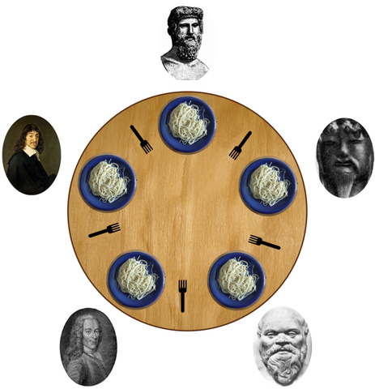

# Weekly Assignments 2

### To be submitted: Friday, 14 August 2020

Note that some tasks may deliberately ask you to look at concepts or libraries
that we have not yet discussed in detail. But if you are in doubt about the
scope of a task, by all means ask.

Please try to write high-quality code at all times!
This means in particular that you should add comments to all parts
that are not immediately obvious.

## W2.1 Roulette

In the casino game [roulette](https://en.wikipedia.org/wiki/Roulette), there are 37 pockets numbered from 0 to 36.
Half of the numbers from 1 to 36 are red, the other half is black.
The number 0 is special.

We can model possible colors with the following simple Haskell
datatype:
```haskell
data Color = Zero | Red | Black
   deriving (Show, Read, Eq, Ord,
```

### Subtask W2.1.1

Implement a function
```haskell
roulette :: IO Color
```

which simulates one random throw at the roulette table and returns
colors with the correct probabilities.

### Subtask W2.1.2

Implement a function
```haskell
histogram :: Int -> IO (Map Color Int)
```

which gets a number of roulette rolls as argument,
simulates that many rolls
and returns a `Map Color Int` which contains the count
of each observed outcome. Outcomes that did never happen
should not occur in the result.

So for example, for one execution of `histogram 5`, the simulated
outcomes could be
`Red`, `Zero`, `Red`, `Black`, `Black`,
in which case the result of that execution would be
```haskell
fromList [(Zero,1),(Red,2),(Black,2)]
```

### Subtask W2.1.3

In roulette, When you bet one dollar on red or black and win,
you get back your one dollar and win an additional dollar.
When you lose, your one dollar is gone.

Consider a player who has a certain number of dollars when she
sits down at the roulette table, and in each round, she bets
one dollar on red. She keeps playing until she runs out of money.
(Note that in theory, she could play forever, but this would be
astronomically unlikely. Sooner or later, she will run out of money.)

Implement a function
```haskell
gamblersRuin :: Int -> IO Int
```

that simulates this player. It gets the original number of dollars
as its single argument and returns the number of steps it took
to run out of money.

## W2.2 Dining Philosophers

The [Dining philosophers problem](https://en.wikipedia.org/wiki/Dining_philosophers_problem)
is a classic problem to demonstrate synchronization issues in concurrent
programming and ways to resolve those problems.



_[By Benjamin D. Esham / Wikimedia Commons, CC BY-SA 3.0](https://commons.wikimedia.org/w/index.php?curid=56559)_

`n` philosophers sit aroung a table, between each of them lies a fork.
We label philosophers and forks by the numbers from 1 to `n` (counterclockwise),
such that fork #1 is the fork between philosophers #1 and #2,
fork #2 is the fork between philosophers #2 and #3 and so on.

The philosophers are hungry from their discussions and want to eat.
In order to eat, a philosopher has to pick up the fork to his left and the fork
to his right.
Once he has both forks, he eats, then puts the forks down again, then
immediately becomes hungry again and again wants to eat.

We model each philosopher as its own concurrent Haskell thread.
For each of the subtasks, log some output to the screen,
so that you can observe which philosopher is holding which fork
and which philosopher is eating.
You may need to come up with a way to ensure that
the log output is not garbled, even though all philosopher
threads try to log concurrently.

Provide one executable for each subtask, where `n` can be
provided as a command line argument. Keep the executables
as small as possible and implement most code in the library.

Try to share as much code as possible between subtasks!

### Subtask W2.2.1

First we want to demonstrate the danger of _deadlock_.
Use an `MVar ()` for each fork, where an empty `MVar`
means that the fork has been picked up.
Implement the philosophers by having them always pick the left fork
first, then the right fork.

Observe that very soon, there will be deadlock.

### Subtask W2.2.2

One classic strategy for deadlock avoidance is to impose a _global order_
on the order in which locks are taken.
Change your deadlock-prone program from above in such a way that now,
each philosopher first tries to pick up the fork _with the lower number_,
then the fork _with the higher number_.

Observe that the deadlock problem is fixed and that the philosophers can all
eat.

### Subtask W2.2.3

Finally, we want to see how using `STM` avoids the deadlock problem without the
need for any global order of locks: Represent forks as `TVar Bool`'s,
where value `False` means that the fork is on the table, `True` means
it has been picked up.
Have the philosophers try to pick up the left fork first, then the right one.

Observe that again, we have no deadlock.

## W2.3 Unsafe IO

In this task, we're going to show that `unsafePerformIO :: IO a -> a` is
not just a function that can lead to unpredictable results, but it can
in fact be really dangerous and lead to crashes such as segmentation faults.

For this, we're going to combine `unsafePerformIO` with mutable references,
so you will need the following modules:

```haskell
import Data.IORef
import System.IO.Unsafe (unsafePerformIO)
```

### Subtask W2.3.1

Just to practice working with `IORef`s, write a function
```haskell
relabelTree :: Tree a -> IO (Tree (a, Int))
```
where
```haskell
data Tree a = Leaf a | Node (Tree a) (Tree a)
```
that assigns unique integer labels from left to right
to all of the leaves, starting from `1`.
This time, we do not want to use the
`State` type, but simply make use of an `IORef Int` to hold the
counter.

In this part, you should _not_ use `unsafePerformIO`.

### Subtask W2.3.2

Use `unsafePerformIO` to define a value of type
```haskell
anything :: IORef a
```
Can you see why the presence of such a value is dangerous?

### Subtask W2.3.3

Use `unsafePerformIO` and `anything` to define a function
```haskell
cast :: a -> b
```
that abandons all type safety. Play with `cast` a bit and see
what happens if you cast various types into each other. Can
you find cases where this actually works? And why? Can you
also find cases where this reliably crashes?

## W2.4 Transactions

In most cryptocurrencies, transactions map a number of inputs
to a number of outputs, roughly as follows:
```haskell
data Transaction =
  Transaction
    { tId      :: Id
    , tInputs  :: [Input]
    , tOutputs :: [Output]
    }
  deriving (Show)

type Id = Int
```

The `Id` is simply a unique identifier for the transaction.

The idea is that all the inputs are completely consumed, and
the money contained therein is redistributed to the outputs.

An `Output` is a value indicating an amount of currency, and
an address of a recipient. We use `String` to model addresses,
and keep values all as integers.
```haskell
data Output =
  Output
    { oValue   :: Int
    , oAddress :: Address
    }
  deriving (Show)

type Address = String
```

An `Input` must actually refer to a previous output, by
providing an `Id` of a transaction and a valid index into
the list of outputs of that transaction.
```haskell
data Input =
  Input
    { iPrevious :: Id
    , iIndex    :: Index
    }
  deriving (Show, Eq, Ord)

type Index = Int
```

In processing transactions, we keep track of "unspent
transaction outputs" (UTxOs) which is a map indicating
which outputs can still be used as inputs:
```haskell
type UTxOs = Map Input Output
```
The outputs contained in this map are exactly the unspent
outputs. In order to refer to an `Output`, we need its
transaction id and its index, therefore the keys in this
map are of type `Input`.

### Subtask W2.4.1

A transaction is called _valid_ if all its inputs refer
to unspent transaction outputs, and if the sum of the values
of its outputs is smaller than or equal to the sum of the
values of its inputs. (In real cryptocurrencies, the amount
by which it is smaller is usually considered to be the transaction
fee and not lost, but reassigned to the block creator in a
special transaction. But in our small example, that money simply
disappears.)

In the light of this, implement a function
```haskell
processTransaction :: Transaction -> UTxOs -> Either String UTxOs
```
that checks if a transaction is valid and at the same time
updates the UTxOs by removing the ones that are used by the
transaction
and adding the ones that are newly created by the transaction.
If the transaction is invalid, an error message should be produced.

Then, write a function
```haskell
processTransactions :: [Transaction] -> UTxOs -> Either String UTxOs
```
that processes many transactions in sequence and aborts if there
is an error.

### Subtask W2.4.2

Construct example transactions `tx1`, `tx2`, `tx3`, `tx4` and `tx5`
and an initial state of unspent transaction outputs `genesis`
(that determines the initial money distribution,
because we have no way to create money here),
and verify that `processTransaction` and `processTransactions`
behave as intended.

### Subtask W2.4.3

For the previous subtask, you will have to write several functions
of the type
```haskell
UTxOs -> Either String (a, UTxOs)
```
This looks like a combination of the `State` type with `Either`.

Let's define
```haskell
newtype ErrorState s a =
    ErrorState {runErrorState :: s -> Either String (a, s)}
```

Define a `Monad` instance (and the implied `Functor` and `Applicative` instances)
that combines the ideas of the monad instances for `Either` and `State`, i.e.,
it aborts as soon as an error occurs (with an error message), and it threads
the state through the computation.

Also define the functions:
```haskell
throwError :: String -> ErrorState s a
get :: ErrorState s s
put :: s -> ErrorState s ()
```
in similar ways as we had done for the individual monads.

### Subtask W2.4.4

Rewrite `processTransactions` and all the helper functions to use the
`ErrorState` type.
